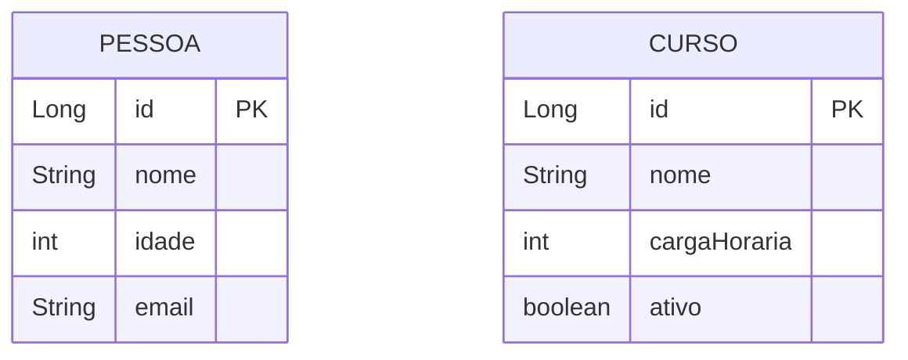

# Backend Spring Boot

## O que está sendo feito nesta branch?

### Objetivo
Esta branch faz a migração do backend de um banco NoSQL (MongoDB) para um banco relacional (H2 em memória, facilmente adaptável para PostgreSQL/MySQL). O sistema passa a usar JPA/Hibernate para persistência, aproveitando recursos de bancos relacionais como integridade referencial, SQL e transações.

---

### Principais mudanças

- **Dependências**: Adicionadas as dependências do Spring Data JPA e H2 no `pom.xml`.
- **Configuração**: O arquivo `application.properties` foi alterado para configurar o datasource H2 e o Hibernate.
- **Modelos**: As entidades (ex: `Pessoa`, `Curso`) agora usam anotações JPA (`@Entity`, `@Table`, `@Id`, etc.).
- **Repositórios**: Agora usam `JpaRepository` ao invés de repositórios Mongo.
- **Controllers e Services**: CRUD permanece igual, mas agora opera sobre entidades JPA.
- **Dockerfile**: Permite build e execução do backend em ambiente isolado.

---

### Diagrama Conceitual

---

### Fluxo de execução

1. O usuário faz uma requisição HTTP para `/api/pessoas` ou `/api/cursos`.
2. O Controller recebe a requisição e chama o Service.
3. O Service utiliza o Repository (JPA) para acessar o banco relacional H2.
4. O resultado é retornado ao usuário em formato JSON.

---

### Vantagens da abordagem

- Permite uso de SQL e recursos de bancos relacionais.
- Facilita a migração futura para bancos como PostgreSQL ou MySQL (basta trocar a configuração).
- Aproveita o ecossistema Spring Data JPA.

---

> Se quiser um diagrama de sequência, exemplos de queries, ou detalhamento de outra camada, só avisar!